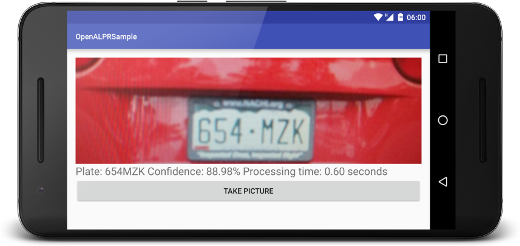
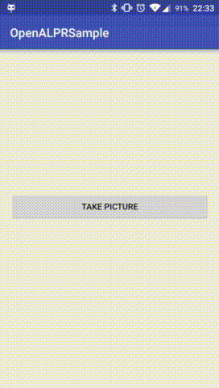

# openalpr-android

OpenALPR is an open source Automatic License Plate Recognition library written in C++ with bindings in C#, Java, Node.js, and Python. This project ports this library to Android.



# Gradle Dependency

## Repository

First, add the following to your app's `build.gradle` file:

```Gradle
repositories {
    maven { url "https://jitpack.io" }
}
```

Them include the openalpr-android dependency:

```gradle
dependencies {

    // ... other dependencies here.    	
    compile 'com.github.SandroMachado:openalpr-android:1.0.0'
```

# Usage

## Code

Copy the [OpenALPR configuration file](./openalpr.conf) to your android project assets directory `/main/assets/runtime_data/openalpr.conf` and update the `runtime_dir` to your project directory (for instance, for the sample project the directory is: `runtime_dir = /data/data/com.sandro.openalprsample/runtime_data`). After that just follow the code example bellow. To see a full example check the [sample application](./Sample/OpenALPRSample/app/src/main/java/com/sandro/openalprsample/MainActivity.java).

```Java

static final String ANDROID_DATA_DIR = "/data/data/com.sandro.openalprsample";

final String openAlprConfFile = ANDROID_DATA_DIR + File.separatorChar + "runtime_data" + File.separatorChar + "openalpr.conf";

String result = OpenALPR.Factory.create(MainActivity.this, ANDROID_DATA_DIR).recognizeWithCountryRegionNConfig("us", "", image.getAbsolutePath(), openAlprConfFile, 10);
```

## Interface

```Java
/*
 Method interface.
*/

/**
 * Recognizes the licence plate.
 *
 * @param country        - Country code to identify (either us for USA or eu for Europe). Default=us.
 * @param region         -  Attempt to match the plate number against a region template (e.g., md for Maryland, ca for California).
 * @param imgFilePath    - Image containing the license plate.
 * @param configFilePath - Config file path (default /etc/openalpr/openalpr.conf)
 * @param topN           - Max number of possible plate numbers to return(default 10)
 *
 * @return - JSON string of results
 */
 
public String recognizeWithCountryRegionNConfig(String country, String region, String configFilePath, String imgFilePath, int topN);

```
# Sample Application

The repository also includes a [sample application](./Sample/OpenALPRSample) that can be tested with Android Studio.



# Credits

 - [https://github.com/openalpr/openalpr](https://github.com/openalpr/openalpr) (the project repository)
 - [https://github.com/sujaybhowmick/OpenAlprDroidApp](https://github.com/sujaybhowmick/OpenAlprDroidApp) (for the compiled sources and for the sample that helped me to port the project to an android library)


